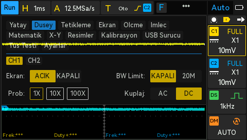
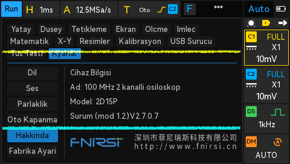
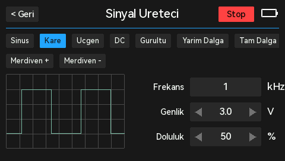
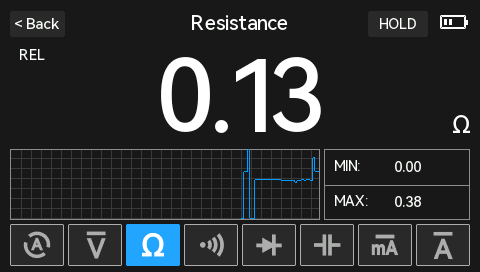

# FNIRSI 2D15P: multimeter-first firmware mod

[](https://github.com/giray/fnirsi-2d15p-mod/actions/workflows/check.yml)
**Project:** <https://github.com/giray/fnirsi-2d15p-mod>, with downloads on the
[Releases](https://github.com/giray/fnirsi-2d15p-mod/releases) page. Current
version: **mod 1.4**.

An unofficial modification of the **FNIRSI 2D15P** (100 MHz 2-channel scope +
True RMS multimeter + DDS generator) firmware for people who mainly use it as a
**multimeter**. It boots into the meter, adds one-touch **probe-zero (REL)**,
remaps the DDS key, fixes the **English** text and adds an optional **Turkish,
German or Dutch** UI, and can **stream readings to a Linux PC**.

> **Firmware V2.7.0.7 only** (`2D15P_V2.7.0.7_260826.bin`, CRC32 `B43E8C2D`).
> Every patch checks this and refuses any other file. Not affiliated with
> FNIRSI. You flash this at your own risk; read [SAFETY.md](SAFETY.md).

| English | Turkish: DMM page |
|---|---|
|  |  |
| **German** | **Dutch** |
|  |  |
| **Turkish** | **Dutch** |
|  |  |
| **Turkish: About** | **Turkish: generator** |
|  |  |
| **Probe-zero (REL) active** | |
|  | |

## What it changes

**Multimeter first** (`firmware/dmm-first.json`)
- Boots into the **multimeter** instead of the oscilloscope.
- The **DDS key** toggles scope ↔ multimeter. The signal generator stays
  available from the main menu.
- The **DDS key LED** is lit on the multimeter page (and, as before, whenever
  the generator output is on).
- The **Menu key** works on the multimeter page: it returns to the scope with
  the main menu open (stock ignores it there).

**Probe-zero / REL** (`firmware/dmm-rel.json`)
- On the multimeter page, **long-press the Run/Stop key** to null the current
  reading (lead resistance, a DC offset). A **REL** marker shows and readings
  become relative. Long-press again to clear; it auto-clears if you change
  function or range. A short tap of Run/Stop is still HOLD.

**Multimeter readings on a PC** (`firmware/dmm-stream.json`, `host/dmm_read.py`)
- While the multimeter page is shown and a program has the USB serial port open,
  the device streams each reading as a text line, so a Linux PC can display or
  log it. See [Multimeter readings on Linux](#multimeter-readings-on-linux)
  below. No effect if unused.

**Languages** (`lang/`)
- Corrected English, e.g. Level → Horizontal, Ramp → Triangle, Skew → Offset,
  Regarding → About, Auto Shut → Auto Off, On-off → Continuity,
  "2.bmpSaving..." → "2.bmp saving...", clearer USB and low-battery messages.
- **One secondary language replaces Chinese**: Turkish, German or Dutch (or
  none). Written in plain ASCII (`Turkce`, `Lautstaerke`) because the device
  fonts have no accented letters.
- **Three-row top menu**, so full labels fit without covering the submenu;
  the touch zones are moved to match.
- English is the default after a factory reset.
- **Settings → About** shows the mod version (`Version (mod 1.4):V2.7.0.7`),
  so you can always tell which build is installed.

Measurement, calibration and the FPGA are not touched.

## Variants

| Variant | Patch set | Result CRC32 |
|---|---|---|
| Multimeter-first only, stock languages | `firmware/dmm-first.json` | `26C71CA2` |
| + English fixes, no second language | `firmware/build/dmm-first+en.json` | `45358968` |
| + English fixes + Turkish | `firmware/build/dmm-first+tr.json` | `8D8C2168` |
| + English fixes + German | `firmware/build/dmm-first+de.json` | `630E5396` |
| + English fixes + Dutch | `firmware/build/dmm-first+nl.json` | `BE4AF67E` |

## Install

1. Download the **official** V2.7.0.7 firmware from FNIRSI and unzip it. You
   need `2D15P_V2.7.0.7_260826.bin` (CRC32 `B43E8C2D`).
2. Make the modified file, either way:
   - **Browser, no install:** get the `.bps` for your variant from the
     [Releases](https://github.com/giray/fnirsi-2d15p-mod/releases) page, open
     [Rom Patcher JS](https://www.marcrobledo.com/RomPatcher.js/), pick the
     stock `.bin` as ROM and the `.bps` as patch, *Apply patch*.
   - **Python 3 (stdlib only):**
     ```bash
     mkdir -p out && python3 tools/fw_patch.py 2D15P_V2.7.0.7_260826.bin firmware/build/dmm-first+de.json -o out/2D15P_V2.7.0.7_260826.bin
     ```
3. Check the result's CRC32 against the table above, and make sure the file is
   named **exactly** `2D15P_V2.7.0.7_260826.bin`.
4. On the device: **Menu → USB Sharing (USB Drive) → ON**. Copy the file into
   the **`Upgrade file`** folder, `sync`/eject, then power-cycle. The updater
   runs and the file disappears.
5. For the second language: **Settings → Language**.

**Reverting:** flash the official file the same way. **If the device doesn't
boot:** power off, **hold the large knob and briefly press power**. The
recovery bootloader appears as a USB drive regardless of the main firmware;
copy the official file into `Upgrade file` and power-cycle. Try this once with
the stock file *before* flashing anything custom ([SAFETY.md](SAFETY.md)).

## Translations

Translations live in `lang/<code>.json`, one entry per UI string with the
English next to it. Corrections and new languages are welcome. See
[lang/README.md](lang/README.md) for the rules (ASCII only, length limits) and
how to build. The builder checks everything it can before writing anything:
ASCII, byte and pixel limits measured with the device's own fonts, and a
self-check of every string read in the patched image.

The Turkish, German and Dutch texts were checked against vendor manuals and
technical references in each language (evidence in `lang/sources/`).
Corrections from native speakers are still very welcome.

## Multimeter readings on Linux

With any mod 1.3 or newer image, the multimeter can stream its readings to a PC. On the
device, show the multimeter page and turn USB Sharing **off** (so it enumerates
as a serial port, not a USB drive). Then:

```bash
# optional: stop ModemManager probing the port, add /dev/fnirsi-2d15p and group access
sudo cp host/99-fnirsi-2d15p.rules /etc/udev/rules.d/ && sudo udevadm control --reload-rules && sudo udevadm trigger

python3 host/dmm_read.py              # live readings
python3 host/dmm_read.py --csv log.csv   # also log (identical consecutive readings collapsed; --all keeps every sample)
```

The device sends one `DMM,<function>,<value>,<unit>,<hold>` line per update
while the port is open (e.g. `DMM,DCV,12.345,V,0`, overrange `DMM,RES,OL,Ohm,0`).
The reader can also send the read-only `*IDN?` query (`--idn`); it never sends
anything else. Nothing is streamed unless a program has the port open.

## Contributing

- **Translations:** edit `lang/<code>.json` and open a pull request, or use the
  *Translation* issue template. New languages are welcome; see
  [lang/README.md](lang/README.md).
- **Bugs:** open an issue with the variant, the mod version from the About
  page and, ideally, a screenshot.
- **Firmware changes:** read [SAFETY.md](SAFETY.md) and the lab notebook in
  [notes/](notes/) first. Every change must be a same-length, CRC-gated patch
  and must not touch calibration data. CI (`tools/check_repo.py`) checks
  everything that can be checked without the firmware image;
  `tools/build_all.sh` checks the rest locally.

## How it works

The image is not encrypted. The MCU application is a Keil-built FreeRTOS
program for an ARMv8-M (Cortex-M33-class) Synwit MCU, linked at `0x12000`
(`MCU address = file offset + 0x11000`). All changes are **same-length byte
patches** applied by `tools/fw_patch.py`, which refuses to run unless the input
CRC32 matches the stock image.

- New code and strings (the language text, the REL and streaming routines) live
  in the bitmap area of the Chinese glyphs in the UI fonts, which nothing draws
  once Chinese is replaced. For languages, the slot pointers are redirected and
  the Chinese-mode layout constants are set to the English values; REL and
  streaming add small Thumb routines hooked into the reading display and the
  USB task.
- The UI/event model, key tables, LED driver, string tables, fonts and DMM data
  path are documented in [notes/](notes/), the lab notebook of this project.

| Tool | |
|---|---|
| `tools/fw_patch.py` | CRC-gated same-length patcher (stdlib) |
| `tools/lang_build.py` | build English + one language into a patch set ([lang/README.md](lang/README.md)) |
| `tools/build_all.sh` | rebuild every variant, make `.bps` release files and SHA256SUMS |
| `tools/fw_font.py` | read the device fonts: widths, CJK glyph area, `--render` previews |
| `tools/fw_inspect.py` | image header, parts, vectors, strings, pointer tables |
| `tools/fw_xref.py` | capstone cross-reference database and disassembly queries |
| `tools/bps_apply.py`, `tools/bps_make.py` | apply / create BPS patches |
| `host/dmm_read.py` | read/log multimeter readings over USB (mod 1.3) |
| `tools/check_repo.py` | firmware-free checks run by CI |

Disassembly tools need `python3 -m venv tools/.venv && tools/.venv/bin/pip install capstone keystone-engine`;
everything else is plain Python 3.

## Changelog

- **mod 1.4:** multimeter REL / probe-zero. On the multimeter page, **long-press
  the Run/Stop key** to null the current reading (lead resistance, a DC offset);
  a **REL** marker shows and readings are relative. Long-press again to clear;
  it auto-clears if you change function or range. A short tap of Run/Stop is
  still HOLD.

- **mod 1.3:** multimeter readings can be streamed to a Linux PC over the USB
  serial port (`host/dmm_read.py`). While the multimeter page is shown and a PC
  has the port open, the device sends `DMM,<function>,<value>,<unit>,<hold>`
  lines. No effect if unused.

- **mod 1.2:** translations reviewed against vendor manuals and Turkish
  engineering sources (sources in `lang/sources/`). For example: TR Dusey,
  Tetikleme, Olcme, Enduktans, Kapasitans; DE Einzel, Werkseinst.,
  "Speichern fehlgeschlagen"; NL Inductiviteit, Persistentie, Rol. Measurement
  readouts use the international abbreviations (Vrms, Vp-p, Duty±), as vendor
  UIs in these languages do.
- **mod 1.1:** fixes the multimeter page's "< Back" button not being drawn
  right after power-on (mod 1.0).
- **mod 1.0:** first release.

## Not done (yet)

- Status-bar words (`Trig'd`, `Stop`, `Roll`, `HOLD`) are English in every
  language; they are not localized in the stock firmware either.
- Scope artefacts below ~4.19 MHz come from the FPGA and can't be fixed here.

## Credits

- [FNIRSI-2D15P-UA](https://github.com/Serhii-Povshednyi/FNIRSI-2D15P-UA) by
  Serhii Povshednyi: the first public mod of this firmware (Ukrainian UI and
  corrected English for V2.7.0.7). It proved the bootloader accepts modified
  images, and its README documents the MCU/FPGA split and the sub-4.19 MHz
  FPGA artefact. This project reuses:
  - most of its **English corrections** (wording, checked against the
    Chinese source strings);
  - its **three-row top-menu geometry** (row height 0x12, stride 0x14 in the
    draw routine and the 13 touch maps).

  None of its files or font data are included. If you want Ukrainian, use his
  mod; the two are separate builds and can't be combined.
- [Capstone](https://www.capstone-engine.org/) and
  [Keystone](https://www.keystone-engine.org/) for (dis)assembly,
  [Rom Patcher JS](https://www.marcrobledo.com/RomPatcher.js/) for patching in
  the browser.

## Licence

The tools, notes and patch sets in this repository are **GPL-3.0** ([LICENSE](LICENSE)).

FNIRSI's firmware is **not** included and must be obtained from FNIRSI;
`.gitignore` keeps `.bin`/`.bps`/`.zip`/`.pdf` files out of the repository.
Patch sets contain only the new bytes, plus short instruction or pointer
context so each patch can be checked before it is applied. Vendor data being
overwritten (glyph bitmaps, Chinese strings) is checked by CRC32 instead of
being copied. The `.bps` release files contain only new bytes.
